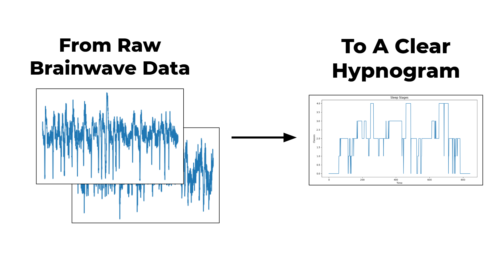

# NeuralFuse
40% of Canadians have a sleep disorder of some kind that negatively impacts their health, productivity, and quality of life. The current diagnosis methods are expensive and time-consuming, leaving our population vulnerable. By running a patient's EEG recordings through a machine learning model, we can analyze their sleep quality and diagnose disorders much more efficiently.

[Click here](https://www.youtube.com/watch?v=cLCrlJfNkdU) to watch me explain the project in depth.

### Data
As input, we have a sequence of 30 second EEG epochs, where each epoch has one of the labels ["W", "N1", "N2", "N3", "REM"](sleep.org/articles/what-happens-during-sleep/). The objective is to go from the raw time-series data to a clear hypnogram.

### Approach
In this case, there are two sub-models. The first sub-model encodes each epoch into a 1D vector (of fixed size). The vector is then passed on to the second sub-model, which labels it as one of five sleep stages ("W", "N1", "N2", "N3", "REM").

A 1D CNN is used in both sub-models, first to encode each epoch and then label the sequence of epochs to create a hypogram.

Using this approach, an accuracy score of 82% was achieved!

### Acknowledgements
1. 1D Convolutional Neural Networks for Time Series Modeling — [https://www.youtube.com/watch?v=nMkqWxMjWzg]
2. A Model for Automatic Sleep Stage Scoring Based on Raw Single-Channel EEG — [https://arxiv.org/pdf1703.04046.pdf]
3. Sleep Stage Classification from Single-Channel EEG Using CNNs — [https://towardsdatascience.com/sleep-stage-classification-from-single-channel-eeg-using-convolutional-neural-networks-5c710d92d38e]